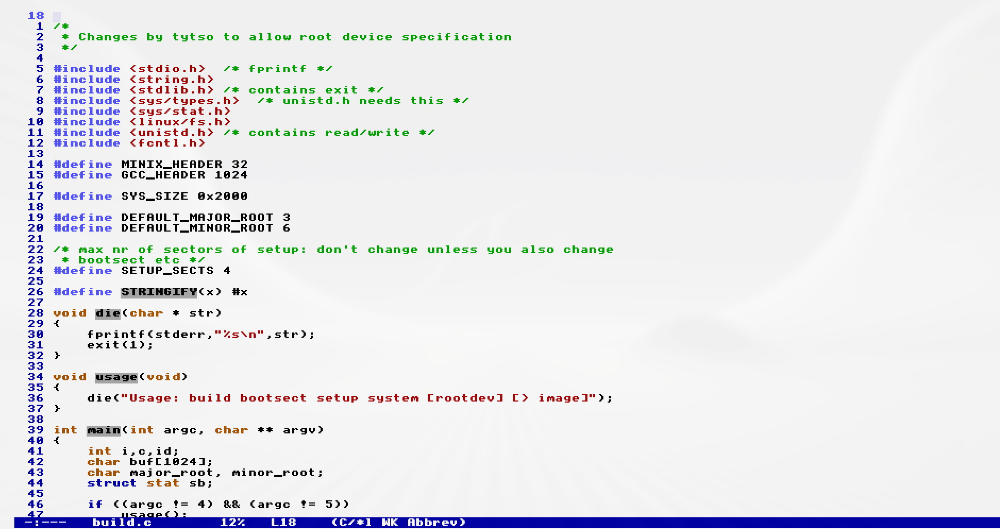
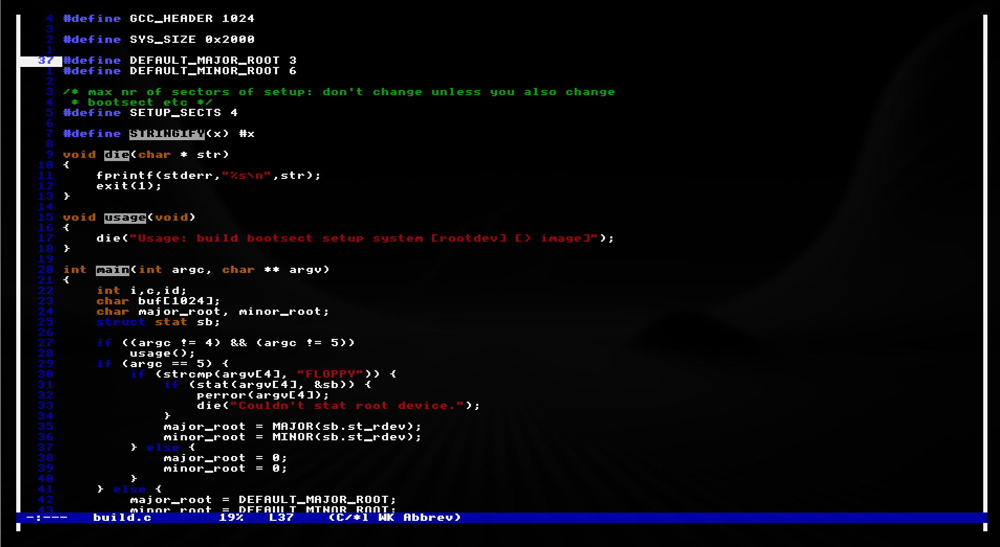

# TempleOS Emacs Theme

The authentic Holy Covenant themes for GNU Emacs, inspired by Terry Davis's TempleOS.
Available in **Light (Canonical)** and **Dark (Heretic)** variants.

## Screenshots

### TempleOS Light (Authentic CGA)


### TempleOS Dark (Heretic)


## Installation

### Manual Installation

1. Clone the repository to your themes directory:
   ```bash
   git clone [https://github.com/Senka07/temple-os-emacs-theme.git](https://github.com/Senka07/temple-os-emacs-theme.git) ~/.emacs.d/themes/

    Add the following to your init.el:
    

    ;; Add the theme directory to load-path
    (add-to-list 'custom-theme-load-path "~/.emacs.d/themes/")

    ;; Load the theme (Choose ONE):
    ;; (load-theme 'temple-os t)    ;; Light Version (Canonical)
    (load-theme 'temple-dark t)  ;; Dark Version (Heretic)

### Installation via use-package (Straight.el / Quelpa)

If you use straight.el or quelpa, add this to your configuration:

```elisp
(use-package temple-os-theme
  :straight (:host github :repo "Senka07/temple-os-emacs-theme")
  :init
  ;; Choose ONE of the lines below:
  ;; (load-theme 'temple-os t)    ;; Light Version
  (load-theme 'temple-dark t)) ;; Dark Version
```

## Troubleshooting

If the colors look wrong (e.g., in a terminal), ensure your terminal supports 256 colors or TrueColor.

### License
GPLv3
